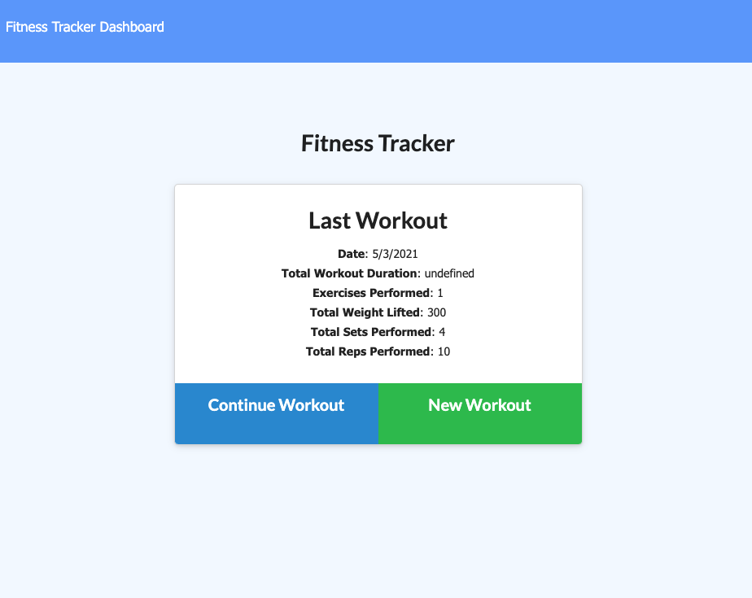
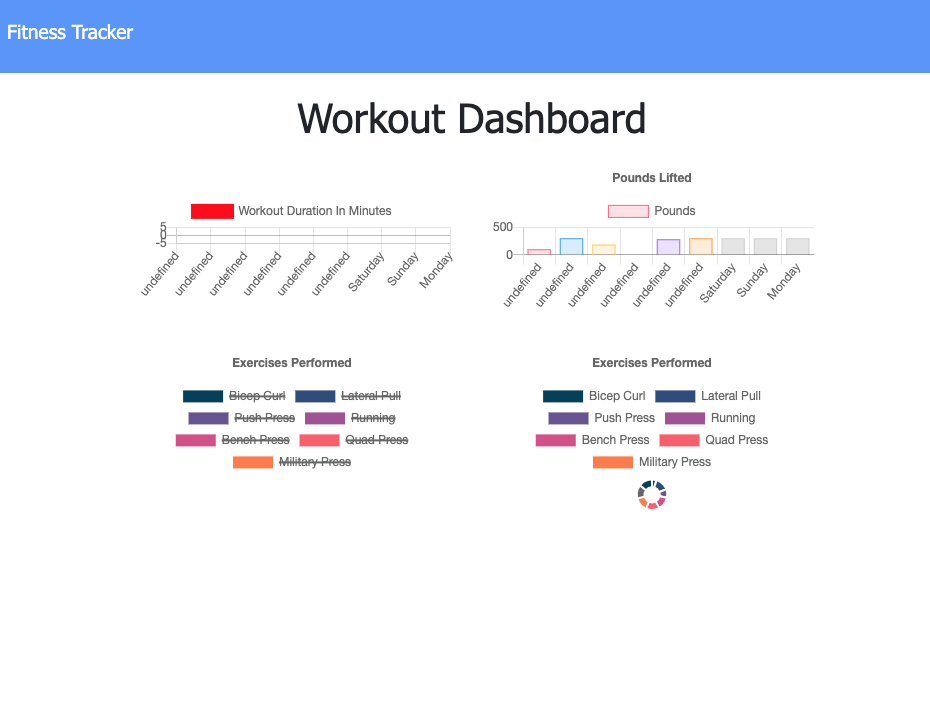

<h1 align="center">Workout Tracker</h1>
<h4 align="center">David Bushard </h4> 
<h5 align="center">Homework 17 </h5>
 

## Table of Contents

- [Description](#description)
- [Installation](#installation)
- [Usage](#usage)
- [License](#license)
- [Contact Info ](#Contact-Info:)
   
   

## Description

A consumer will reach their fitness goals more quickly when they track their workout progress.

- I used MongoDB, Mongoose schema, handle routes with Express and Javascript to make this application work.
   
   

## User Story

As a business owner I want to be able to view and manage the departments, roles, and employees in my company
So that I can organize and plan my business I should be able to store the info on a data base and be able to change it out.

 
 

## Installation

npm install -y
 
 

## Usage

npm run seed
npm run start
 
 

## Links and Images

Repo - https://github.com/DavidBuoy/workout-tracker-
 
Heroku App - https://workout-dbtracker.herokuapp.com/?id=6092f00d8783260015784399
 
 

 

 
 

 

 

## Contact Info:

David Bushard

Find me on GitHub:

 
Email me with any questions: Davidbushard@gmail.com
 
